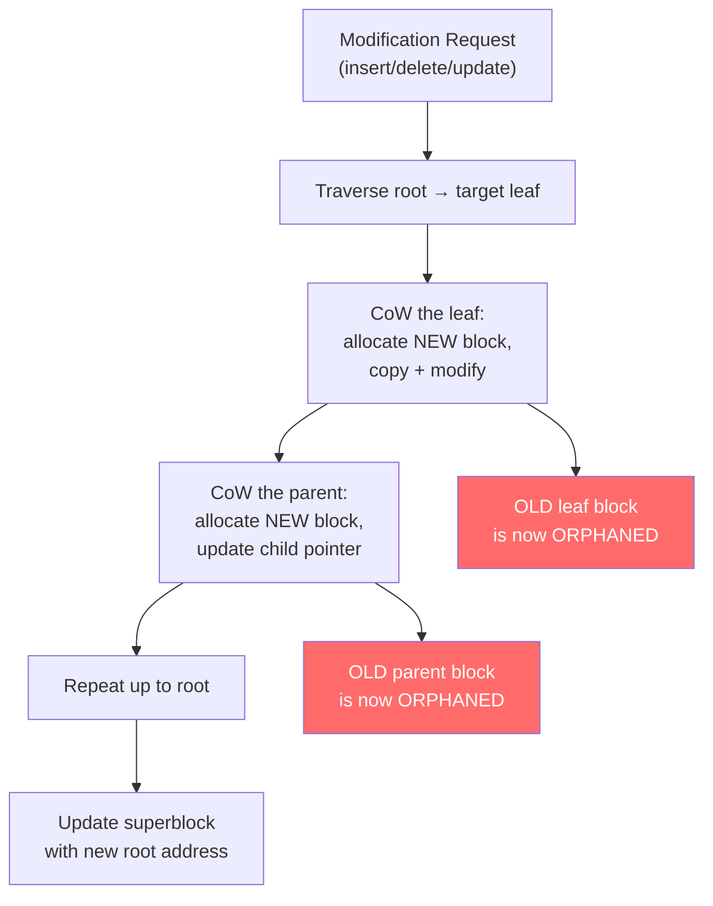
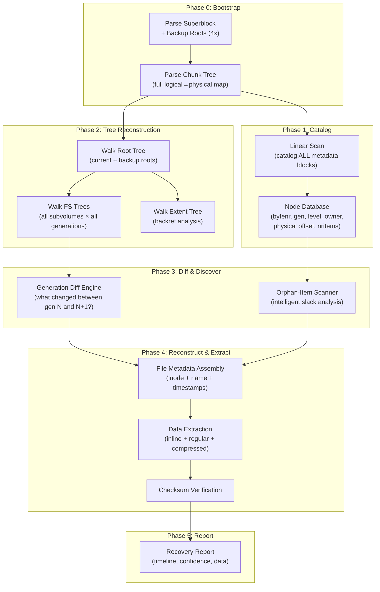

# Btrfs Optimized Recovery — State of the Art & Innovation Roadmap

## 1. What Exists Today: The Landscape

### 1.1 Official btrfs-progs Tools

| Tool | What It Does | Limitations |
|---|---|---|
| **`btrfs-restore`** | Walks the B-tree from a given root, extracts files with relaxed validation. Uses `-t <bytenr>` to target specific old roots. | Only works from a **known root pointer** — you must provide one. Cannot discover deleted items within nodes. No Orphan-Item analysis. |
| **`btrfs-find-root`** | Linear scan for metadata blocks matching `btrfs_header`, groups by generation. Reports candidate root nodes. | Only finds **roots** (high-level nodes). Doesn't parse leaf content, doesn't extract files, doesn't analyze Orphan-Items. Output requires manual interpretation + piping to `btrfs-restore`. |
| **`btrfs inspect-internal dump-tree`** | Dumps the active B-tree structure for debugging. Can target specific trees (`-t chunk`, `-t root`, etc.). | Only works on **mountable** / mostly-intact filesystems. Not a recovery tool. |
| **`btrfs check --repair`** | Attempts to repair corrupted metadata to make the filesystem mountable. | **Destructive** — modifies the filesystem. Not forensic-safe. Known to cause further damage. |

#### How `btrfs-restore` Actually Works (from source analysis)

```
1. Open device, read superblock
2. Parse chunk tree → build logical-to-physical map
3. Read root tree root from superblock (or user-provided -t <bytenr>)
4. Walk root tree → find FS_TREE root(s) for each subvolume
5. Walk FS_TREE recursively:
   - At each leaf: iterate items 0..nritems
   - DIR_ITEM → build directory structure
   - EXTENT_DATA → read file data via chunk map translation
6. Extract files to output directory
```

> [!IMPORTANT]
> **`btrfs-restore` does NOT scan beyond `nritems`**. It only reads valid items in the active tree. It cannot recover files that were deleted within the same generation as the tree root it's reading from. If a file was deleted and the leaf node was updated (CoW'd), the old leaf is invisible to `btrfs-restore` unless you happen to find a root that still points to it.

#### How `btrfs-find-root` Works

```
1. Scan device linearly, nodesize-aligned
2. For each block: read btrfs_header, validate FSID + checksum
3. Record (bytenr, generation, level, owner) for each valid metadata block
4. Group by generation
5. Report blocks with level > 0 as candidate roots
```

> [!NOTE]
> This is essentially what our brute-force scanner does, but `btrfs-find-root` only reports root candidates — it doesn't parse leaf content or extract data.

---

### 1.2 The Sleuth Kit (TSK) + Autopsy

TSK added **experimental** Btrfs support (Hilgert et al., DFRWS 2018). Their implementation:

- Parses superblock → chunk tree → root tree → FS_TREE
- Supports multi-device configurations (RAID)
- Implements Carrier's 5-layer forensic model (physical → volume → filesystem → file → application)
- Can list files, show metadata, recover deleted files from active tree

**Limitations:**
- Experimental status — doesn't handle all configurations
- No support for **historical generation** analysis (can't walk old CoW copies)
- No Orphan-Item analysis
- No generation-based time-travel recovery
- Doesn't scan for orphaned nodes

---

### 1.3 Commercial Tools

| Tool | Status |
|---|---|
| **R-Studio** | Partial Btrfs support, primarily data carving |
| **UFS Explorer** | Basic Btrfs metadata parsing |
| **ReclaiMe** | "Btrfs-aware" but limited documentation |
| **DiskInternals Linux Recovery** | Claims Btrfs support |

All commercial tools focus on **active tree parsing** or generic **data carving** (header/footer signature matching). None implement:
- Orphan-Item analysis
- Generation-based historical tree walking
- B-tree balancing artifact analysis

---

### 1.4 Academic Research

| Paper | Key Contribution |
|---|---|
| **Bhat & Wani (2018)** "Forensic analysis of B-tree file system" | 6-stage evidence extraction procedure. Defined "Orphan-Items" — items beyond `nritems` left by B-tree balancing. Showed redistribution preserves more artifacts than merging. |
| **Wani et al. (2020)** "Anti-forensic capabilities of Btrfs" | Analyzed CoW's effect on data residue. Showed inline data persists in leaf nodes. Regular extent data recoverable if not overwritten. Filesystem "age" increases recovery probability. |
| **Rodeh, Bacik & Mason (2013)** "BTRFS: The Linux B-Tree Filesystem" | Authoritative description of CoW-friendly B-trees, reference counting, clone/snapshot mechanics, top-down update procedure. |
| **Hilgert et al. (2018)** "Forensic analysis of multiple device BTRFS using TSK" | Added Btrfs to TSK. Focused on multi-device/RAID configurations. DFRWS 2018. |

---

## 2. How B-Tree Balancing Works in Btrfs (& Why It Matters for Recovery)

This is the **core theoretical foundation** for optimized recovery. Understanding exactly what happens on disk during B-tree operations reveals where deleted data hides.

### 2.1 The CoW Update Mechanism

Every B-tree modification in Btrfs follows this pattern:



> [!IMPORTANT]
> **Key forensic insight**: Every single modification creates a chain of orphaned blocks from the modified leaf all the way up to the old root. These blocks remain on disk until their physical space is reallocated. The OLD blocks contain the **pre-modification** state — i.e., the deleted file's data.

### 2.2 The Three Balancing Operations

When Btrfs inserts or deletes items, it may need to rebalance the B-tree. The kernel code in `fs/btrfs/ctree.c` implements three operations:

#### 2.2.1 Split (Insertion Overflow)

When a leaf node is full and a new item needs to be inserted:

```
BEFORE (single full node):
┌──────────────────────────────────┐
│ [A][B][C][D][E][F][G][H] (full) │  ← nodesize capacity reached
└──────────────────────────────────┘

AFTER (CoW'd split into two nodes):
┌─────────────────┐  ┌─────────────────┐
│ [A][B][C][D]     │  │ [E][F][G][H][NEW]│  ← new item inserted
└─────────────────┘  └─────────────────┘
         ↑ NEW block                ↑ NEW block

OLD block with [A]-[H] still exists on disk (orphaned)!
```

**Forensic Impact**: 
- The OLD full node remains intact on disk with ALL items
- The split creates two NEW blocks, so total data is duplicated
- Items that were later deleted from either new block remain in the OLD block

#### 2.2.2 Merge (Deletion Underflow)

When deletion makes a node too sparse AND its sibling is also sparse:

```
BEFORE (two sparse nodes):
┌──────────┐  ┌──────────┐
│ [A][B]    │  │ [C]       │  ← both below minimum occupancy
└──────────┘  └──────────┘

AFTER (merged into one node):
┌─────────────────┐
│ [A][B][C]        │  ← single NEW block
└─────────────────┘

BOTH OLD blocks still exist on disk!
Item [C] now appears in BOTH the old right block AND the new merged block.
```

**Forensic Impact**:
- **Two** old blocks are orphaned
- But the merged node only contains the union of remaining items — items that were deleted (triggering the merge) are only in the OLD blocks
- **This is the WORST case for recovery** — the deleted item that triggered underflow is gone from the new merged node

#### 2.2.3 Redistribute (Deletion Underflow, Sibling Has Surplus)

When deletion makes a node too sparse but its sibling has enough items to share:

```
BEFORE:
┌─────────────────┐  ┌──────────────────┐
│ [A]              │  │ [B][C][D][E][F]   │  ← left sparse, right has surplus
└─────────────────┘  └──────────────────┘

AFTER (redistribute from right to left):
┌──────────────┐  ┌──────────────┐
│ [A][B][C]     │  │ [D][E][F]     │  ← balanced
└──────────────┘  └──────────────┘
     ↑ NEW                ↑ NEW

BOTH OLD blocks still exist on disk!
In OLD right block: [B][C][D][E][F] — items [B][C] are now "Orphan-Items"
if the NEW right block's nritems doesn't include them.
```

**Forensic Impact**:
- **This is the BEST case for recovery** (per Paper 2)
- The OLD sibling node contains items that were "moved" but not deleted
- These items appear as **Orphan-Items** — they exist in the OLD block beyond the NEW block's `nritems` count
- The `push_leaf_left` / `push_leaf_right` kernel functions implement this

### 2.3 What Exactly Are "Orphan-Items"?

> [!IMPORTANT]
> **Orphan-Items** (Bhat & Wani, 2018) are a distinct concept from Btrfs's internal "orphan inodes" (which track files open-but-unlinked). Orphan-Items are a **forensic concept**: items that physically exist in a node's data area but are beyond the `nritems` count in the node's header.

They arise from two sources:

1. **Redistribution residue**: When items are moved from node A to node B via `push_leaf_left`/`push_leaf_right`, the OLD version of node A still contains those items. The NEW version of A has a reduced `nritems`, but the data area beyond `nritems` still holds the moved items' bytes.

2. **In-place item deletion**: When an item is deleted within a leaf, the kernel compacts the remaining items and decrements `nritems`. The OLD block (pre-CoW) keeps all items. The NEW block has `nritems-1` items, but the data of the deleted item may still exist in slack space.

### 2.4 Reference Counting & Space Reclamation

A block is only truly "freed" when its reference count drops to 0 in the extent tree. With snapshots:
- A snapshot increments ref-counts of all blocks shared between the snapshot and the live subvolume
- Deleting a file in the live subvolume CoWs the leaf, but the OLD leaf may still be referenced by the snapshot
- Only when the snapshot is also deleted does the ref-count reach 0

**Forensic implication**: On filesystems with snapshots, old blocks are preserved much longer, dramatically increasing recovery probability.

---

## 3. Gap Analysis: What's Missing?

| Capability | btrfs-restore | btrfs-find-root | TSK | Our Brute-Force | Needed |
|---|:---:|:---:|:---:|:---:|:---:|
| Parse active tree | ✅ | ❌ | ✅ | ❌ | ✅ |
| Find old root candidates | ❌ | ✅ | ❌ | ✅ (partial) | ✅ |
| Walk old tree from root | ✅ (manual `-t`) | ❌ | ❌ | ❌ | ✅ |
| Linear scan for orphaned nodes | ❌ | ✅ | ❌ | ✅ | ✅ |
| Parse Orphan-Items (beyond nritems) | ❌ | ❌ | ❌ | ✅ | ✅ |
| Extract inline data | ✅ | ❌ | ✅ | ✅ | ✅ |
| Extract regular extents | ✅ | ❌ | ✅ | ✅ | ✅ |
| Superblock backup roots (4x history) | ❌ | ❌ | ❌ | ❌ | ✅ |
| Generation-sorted tree reconstruction | ❌ | ❌ | ❌ | ❌ | ✅ |
| Extent tree backref analysis | ❌ | ❌ | ❌ | ❌ | ✅ |
| Cross-generation file timeline | ❌ | ❌ | ❌ | ❌ | ✅ |
| Checksum validation | ✅ | ✅ | ✅ | ❌ | ✅ |
| Multi-device / RAID | ✅ | ❌ | ✅ | ❌ | Later |
| Compression support | ✅ | ❌ | ✅ | Stub | Later |

> [!CAUTION]
> **No existing tool combines all these capabilities.** Each tool does one thing — our opportunity is to build the first tool that integrates ALL of these into a unified, intelligent recovery engine.

---

## 4. The Optimized Recovery Architecture

The key insight for optimization is: **don't just scan linearly and hope to find orphaned blocks. Instead, use the filesystem's own structural information to guide the search.**

### 4.1 Strategy 1: Superblock Backup Roots (Free Historical Entry Points)

The superblock contains **4 `btrfs_root_backup` entries** at offset `0xB2B` (2859 bytes into the superblock). Each backup is **168 bytes** and stores:

```c
struct btrfs_root_backup {
    __le64 tree_root;           // logical address of root tree root
    __le64 tree_root_gen;       // generation of tree root
    __le64 chunk_root;          // logical address of chunk tree root  
    __le64 chunk_root_gen;      // generation of chunk tree root
    __le64 extent_root;         // logical address of extent tree root
    __le64 extent_root_gen;     // generation of extent tree root
    __le64 fs_root;             // logical address of FS tree root
    __le64 fs_root_gen;         // generation of FS tree root
    __le64 dev_root;            // logical address of dev tree root
    __le64 dev_root_gen;        // generation of dev tree root
    __le64 csum_root;           // logical address of csum tree root
    __le64 csum_root_gen;       // generation of csum tree root
    __le64 total_bytes;
    __le64 bytes_used;
    __le64 num_devices;
    // ... padding to 168 bytes
};
```

**These give us ROOT ADDRESSES for the last 4 successful transactions!**

Instead of scanning the entire disk, we can:
1. Parse all 4 backup roots
2. For each backup, walk the `tree_root` → find FS_TREE root → walk the FS_TREE
3. Any file that exists in an older backup but not in the current tree was **recently deleted**

This is O(tree_height × items) instead of O(disk_size / nodesize).

### 4.2 Strategy 2: Root Tree Walk (Structural Discovery)

Instead of scanning every block on disk:

```
1. Parse superblock → get root_tree_addr
2. Walk root tree:
   - For each ROOT_ITEM: extract the subvolume tree root address
   - This gives us ALL subvolume roots, including deleted subvolumes
3. For each subvolume root: walk the FS_TREE to extract files
4. Compare across generations to find deleted files
```

The root tree is small (usually a single leaf or a few nodes). Walking it is O(1) compared to the O(disk_size) linear scan.

### 4.3 Strategy 3: Generation-Indexed Node Database

Instead of processing each orphaned node independently during a single linear scan, build an **indexed database** of ALL discovered metadata blocks:

```python
# Phase 1: Catalog (single linear scan)
node_catalog = {}  # keyed by (logical_address, generation)
for offset in range(SB_OFFSET + nodesize, disk_size, nodesize):
    header = read_header(offset)
    if valid_fsid(header):
        node_catalog[(header.bytenr, header.generation)] = {
            "physical_offset": offset,
            "level": header.level,
            "owner": header.owner,
            "nritems": header.nritems,
        }

# Phase 2: Reconstruct trees by following parent→child pointers
# For each internal node in the catalog:
#   Read its key_ptrs → find children in the catalog
#   Build a tree structure for each generation
```

This allows us to:
- **Reconstruct complete historical trees** for any generation
- **Diff trees across generations** to precisely identify what was deleted/modified
- Find items that exist at generation N but not at generation N+1 → those were deleted in transaction N+1

### 4.4 Strategy 4: Extent Tree Backref Analysis

The extent tree contains **backreferences** for every allocated extent:

```
EXTENT_DATA_REF:
    root (8 bytes)    - which subvolume tree
    objectid (8 bytes) - which inode
    offset (8 bytes)   - offset within the file
    count (4 bytes)    - reference count
```

By scanning the extent tree (which is itself a B-tree that can be found via the root tree), we can:

1. Find all data extents and their owners
2. For extents with ref-count = 0 → data was deleted but extent entry still exists
3. Cross-reference extent addresses with the chunk map to locate the physical data
4. **Reverse-map**: given a data extent on disk, determine which file it belonged to

This is particularly powerful for **large file recovery** where the inline data approach fails.

### 4.5 Strategy 5: Log Tree Analysis

Btrfs maintains a **log tree** for fsync optimization. It contains recently fsync'd data that may not yet be committed to the main tree. The log tree root is stored at superblock offset `0x60`.

- The log tree contains INODE_ITEM, DIR_ITEM, and EXTENT_DATA items
- It may contain data from files that were modified just before a crash
- On mount, Btrfs replays or discards the log tree — but its blocks remain on disk

### 4.6 Strategy 6: Intelligent Orphan-Item Scanning

Instead of our current approach of blindly scanning beyond `nritems` and hoping for valid item headers, we can be smarter:

1. **Analyze the node's data area layout**: In a leaf node, item data grows from the END of the node backward, while item pointers grow from the START forward. Between the last item pointer and the first data byte is free space. We can scan this free space for remnant item structures.

2. **Use the data_offset field**: The `data_offset` in each item pointer tells us where the data lives relative to the end of the header. If we find an orphan item pointer that references a data_offset that falls in a "valid" region (within the node, after the item pointers, before existing data), it's likely genuine.

3. **Cross-reference with known inodes**: If an orphan item pointer's objectid matches an inode we've seen in other nodes, it's more likely to be real.

4. **Entropy analysis**: For alleged inline extent data, check if the entropy profile matches expected file types (text, images, etc.) vs. random garbage.

---

## 5. Proposed Architecture for the Optimized Engine



### Performance Comparison

| Approach | Time Complexity | What It Finds |
|---|---|---|
| **Brute-Force** (current) | O(disk_size / nodesize) | All orphaned nodes, but no structural context |
| **Root Walk** (Strategy 1-2) | O(tree_size × generations) | Files visible at specific points in time |
| **Generation Diff** (Strategy 3) | O(nodes × log(nodes)) | Precisely what was deleted when |
| **Backref Analysis** (Strategy 4) | O(extent_tree_size) | Owner info for every data extent |
| **Combined** | O(disk_size / nodesize) for catalog, then O(tree_size × generations) for analysis | **Everything above, unified** |

> [!TIP]
> The catalog scan (Phase 1) has the same cost as our current brute-force scan. The optimization comes from what we **do** with the catalog afterward — instead of just parsing each node independently, we reconstruct complete historical tree views and diff them.

---

## 6. Innovation Opportunities

These are areas where no existing tool operates — opportunities for novel contribution:

### 6.1 Cross-Generation File Timeline

Build a complete **timeline** of every file's lifecycle:
```
Inode 257: "important_doc.txt"
  Gen 10: Created (INODE_ITEM.otime = 2025-01-15 10:30:00)
  Gen 10: Data written (inline extent, 512 bytes)
  Gen 12: Modified (new extent, 2048 bytes) 
  Gen 14: Deleted (absent from Gen 14 FS tree)
  Recovery: Inline data from Gen 10 node, Regular extent from Gen 12 node
```

No existing tool produces this timeline. It requires cross-referencing nodes across generations.

### 6.2 Predictive Overwrite Analysis

Using the extent tree and free space tree, determine the **probability** that a deleted file's data extents have been overwritten:
- Check if the extent's logical address range has been reallocated in the current extent tree
- If not reallocated → high confidence recovery
- If reallocated → data may be partially or fully overwritten

### 6.3 B-Tree Operation Reconstruction

By analyzing the pattern of old vs. new nodes, reconstruct the **sequence of B-tree operations** that led to a file's deletion:
- Was it a simple delete (single CoW chain)?
- Did it trigger a merge (two old nodes → one new node)?
- Did it trigger redistribution (items moved between siblings)?

This tells the forensic examiner exactly how the deletion happened and where to find maximum data.

### 6.4 Internal Node Slack Mining

Internal (non-leaf) nodes that were previously leaf nodes may contain **residual leaf data** in their slack space:
- An internal node only uses 33 bytes per key_ptr
- If the node was previously a leaf, the data area (which grows from the end backward) may still contain old item data
- This requires scanning internal nodes' unused space for valid item structures

### 6.5 Checksum-Guided Data Validation

Btrfs stores checksums for all data in the checksum tree. By parsing old checksum tree nodes, we can:
- Validate recovered data against its expected checksum
- Determine if recovered data is complete and unmodified
- Assign a **confidence score** to each recovery

---

## 7. Recommended Implementation Order

| Priority | Strategy | Effort | Impact |
|---|---|---|---|
| 🔴 P0 | **Superblock backup roots** → walk 4 historical trees | Low | High — immediate access to last 4 transaction states |
| 🔴 P0 | **Checksum verification** (CRC32c) for scanned nodes | Low | High — eliminates false positives |
| 🟡 P1 | **Node cataloging** → build generation-indexed database | Medium | High — enables all subsequent strategies |
| 🟡 P1 | **Root tree walk** → discover all subvolume roots | Medium | High — find files without full-disk scan |
| 🟢 P2 | **Generation diff engine** → identify deleted files | Medium | Very High — the core innovation |
| 🟢 P2 | **Extent tree backref** → reverse-map extents to files | Medium | High — large file recovery |
| 🔵 P3 | **Cross-generation timeline** | High | Very High — unique forensic capability |
| 🔵 P3 | **Internal node slack mining** | Medium | Medium — additional data source |
| ⚪ P4 | **Compression support** (zlib/lzo/zstd) | Low-Medium | Medium |
| ⚪ P4 | **Multi-device / RAID** | High | Niche but important |

---

## 8. Summary

**What we have today (our brute-force tool)** is equivalent to what `btrfs-find-root` does, but better: we already parse leaf content and extract data, which `btrfs-find-root` doesn't.

**What `btrfs-restore` does** that we don't: structural tree walking from a known root. But it can't find orphaned nodes or Orphan-Items.

**What nobody does**: Generation-diff analysis, cross-generation file timelines, intelligent Orphan-Item analysis with cross-referencing, extent backref reverse mapping, and predictive overwrite analysis.

**The innovation** is combining ALL of these into a single tool:

```
                    ┌──────────────────────────────┐
                    │     Unified Recovery Engine  │
                    ├──────────────────────────────┤
                    │  Brute-Force Scan (current)  │ ← what we have
                    │  + Superblock Backup Roots   │ ← free wins
                    │  + Root Tree Walk            │ ← structural discovery
                    │  + Node Catalog + Gen-Diff   │ ← the core innovation
                    │  + Extent Backref Analysis   │ ← large file recovery
                    │  + Orphan-Item Intelligence  │ ← unique forensic data
                    │  + Checksum Validation       │ ← confidence scoring
                    │  + Cross-Gen Timeline        │ ← forensic reporting
                    └──────────────────────────────┘
```

This would be the **first tool of its kind** — no existing open-source or commercial tool combines structural tree walking with orphaned node scanning, Orphan-Item analysis, and generation-based diffing.
